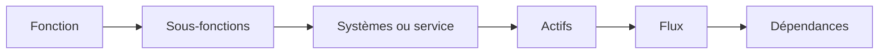

## Segmentation Réseau

La segmentation réseau est une approche fondamentale de la défense en profondeur (notion que j'aborderai dans un autre article). Elle consiste à découper un environnement réseau global en plusieurs domaines de confiance distincts afin d’appliquer le principe du moindre privilège, de réduire la surface d’attaque globale et de limiter la propagation latérale de codes malveillants ou d'attaques par rançongiciel.

Principes généraux de la segmentation réseau
* Découpage en zones de confiance homogènes : Le réseau doit être cloisonné en différentes zones regroupant des actifs ayant des besoins de sécurité et des niveaux de sensibilité ou d’exposition homogènes (ex. : serveurs internes, postes de travail, zone d'administration)
. Les flux circulant entre ces différents segments doivent être strictement contrôlés

* Cloisonnement physique ou logique :
- Le cloisonnement physique repose sur des équipements et des liaisons dédiés, sans mutualisation avec d'autres réseaux. Il offre une séparation forte entre les environnements, au prix d'une infrastructure plus importante et généralement plus complexe à faire évoluer. Il est recommandé de le privilégier pour les zones à forte criticité.
- Le cloisonnement logique (VLAN, PVLAN) est mis en œuvre lorsque la séparation physique n’est pas possible ou trop coûteuse. Bien que plus simple à déployer, iLe cloisonnement logique permet de séparer plusieurs domaines sur une infrastructure mutualisée. Il nécessite cependant une configuration rigoureuse des équipements et des mécanismes de filtrage : un VLAN seul ne constitue pas une barrière de sécurité suffisante.

* Isolation stricte du réseau d’administration (plan de contrôle) : Les flux d’administration doivent transiter par un réseau dédié, physiquement ou logiquement disjoint du réseau de production ou des données métiers. Pour le réseau industriel, il est fortement recommandé d'utiliser des ports physiques exclusivement dédiés aux consoles d'administration sur les commutateurs et pare-feux pour interdire tout mélange de flux.

* Filtrage par défaut (White-listing) : Tous les flux de communication inter-zones doivent être interdits par défaut et autorisés par exception. Chaque flux autorisé doit être finement décrit (IP source, IP destination, protocole, ports de communication).

* Blocage des communications latérales (Micro-segmentation) : Pour complexifier la tâche d'un attaquant cherchant à se latéraliser, il faut bloquer les communications directes entre des machines d’une même zone (ex. : entre deux postes de travail). Cela se traduit par l'activation des pare-feux locaux sur les terminaux ou par la mise en place de Private VLAN (PVLAN) en mode isolé sur les commutateurs.

* Séparation des environnements : Il est nécessaire d’isoler rigoureusement les systèmes de production opérationnels des environnements de développement, de test et de sauvegarde.
Le cas particulier de l'Active Directory (AD) : Le cloisonnement des zones de confiance d’un réseau AD ne peut pas reposer uniquement sur des pare-feux réseau, car ces derniers doivent laisser passer les protocoles d'annuaire (RPC, SMB, Kerberos) dont ils ne contrôlent pas le contenu. Dans un environnement Active Directory, la segmentation réseau ne peut pas constituer à elle seule une mesure de protection suffisante. Les relations de confiance entre contrôleurs de domaine, serveurs et postes nécessitent également des mesures de durcissement, de contrôle des privilèges et de sécurisation des protocoles utilisés par les services d'annuaire.

**Spécificités de la segmentation liées à l'OT**

Les architectures industrielles (OT) s'appuient historiquement sur des protocoles (Modbus, OPC, Profinet, BACnet, etc.) qui n'intègrent pas nativement de mécanismes de sécurité, ce qui les rend très vulnérables aux attaques réseau. L'ANSSI préconise d'appliquer la segmentation en trois étapes successives : isoler l'IT de l'OT via une DMZ, segmenter le réseau OT, puis configurer de la micro-segmentation au plus près des machines.

* Structuration selon le modèle de Purdue (ISA-95)
Le réseau industriel doit être modélisé et segmenté en niveaux logiques cohérents pour dissocier les traitements :
Niveau 0 — Terrain : capteurs et actionneurs ;
Niveau 1 — Contrôle : automates, RTU, contrôleurs ;
Niveau 2 — Supervision : IHM, stations opérateur, SCADA ;
Niveau 3 — Opérations : MES, Historian, systèmes de gestion de production ;
Niveau 3.5 — DMZ industrielle : services intermédiaires entre OT et IT ;
Niveau 4 — IT : services d'entreprise ;
Niveau 5 — Internet / services externes, selon l'architecture.
Notez que Purdue est un modèle de référence et non une architecture de sécurité à appliquer mécaniquement.

* La frontière IT/OT et l'interconnexion au SI de gestion
Interdiction des connexions directes : Aucun équipement de terrain (automates, capteurs) ni aucun poste de supervision SCADA ne doit avoir d’accès direct à Internet ou au réseau informatique bureautique.
Mise en place d'une DMZ industrielle : L’interconnexion entre le SI de gestion et le SI industriel doit être maîtrisée au travers d'une zone intermédiaire de type DMZ industrielle, permettant de contrôler et de limiter les flux entre les deux environnements. Cette DMZ doit abriter des systèmes relais (antivirus, serveurs de mise à jour, passerelles de télémaintenance, serveurs d'historiques) pour assurer une rupture de flux hermétique entre les deux mondes.
Double barrière et rupture protocolaire : Il est courant de s'entendre dire que l'interconnexion IT/OT doit être protégée par deux dispositifs de filtrage réseau (pare-feux de constructeurs différents) et intégrer des passerelles de transformation de données pour assurer une rupture protocolaire complète. Ça c'est dans l'idéal, cette mesure ajoute de contrainte opérationnelle forte a commencer par les resources RH, je garderai cette mesure pour les infrastructures critiques présentant des exigences de sécurité élevées. Dans plein de cas, l'utilisation de technologies ou de solutions distinctes permet également de réduire le risque lié à une vulnérabilité commune.

Liaisons unidirectionnelles (Diodes) : Pour certains systèmes industriels présentant des exigences de sécurité très élevées, une diode réseau ou une passerelle unidirectionnelle peut être utilisée afin de permettre la remontée d'informations tout en empêchant physiquement les communications dans le sens inverse.

* Cloisonnement interne de l'OT
Ségrégation des systèmes de sûreté (SIS) : Il est fortement recommandé de cloisonner physiquement (ou au moins logiquement par VLAN) les automates de sécurité fonctionnelle (SIS) – qui préviennent les accidents industriels majeurs – des automates standards de contrôle-commande (BPCS).
VLANs industriels dédiés : Le cloisonnement logique de l’OT doit s’articuler autour de VLANs dédiés par usage :
- Un VLAN d'administration des commutateurs et serveurs
- Un VLAN pour les stations d'ingénierie et consoles de programmation
- Un VLAN de supervision pour les serveurs SCADA et les postes de conduite
- Un VLAN pour les serveurs métiers (MES)
- Un VLAN dédié par procédé physique contenant les automates et leurs entrées/sorties déportées

Micro-segmentation par PVLAN : Les dispositifs du réseau de terrain n'ayant pas de raison légitime de communiquer directement entre eux, il faut configurer des Private VLAN (PVLAN) en mode isolé sur les commutateurs industriels. Les Private VLAN (PVLAN) peuvent être utilisés pour empêcher les communications directes entre certains équipements d'un même segment, tout en autorisant leurs échanges avec des ressources communes telles qu'une passerelle ou un serveur autorisé.

Filtrage applicatif profond (DPI) : Pour les communications autorisées à traverser les zones, il est recommandé d’utiliser des pare-feux industriels capables d'effectuer de l'inspection de paquets en profondeur (DPI - Deep Packet Inspection). Le DPI permet de filtrer non seulement les adresses IP, mais aussi les commandes spécifiques au sein des protocoles industriels (par exemple, n’autoriser qu'un flux de "lecture" Modbus et bloquer l'écriture). Certains pare-feux industriels disposent de capacités DPI permettant d'identifier des fonctions ou commandes propres à certains protocoles industriels. Il devient alors possible, selon les capacités du produit, de restreindre plus finement les opérations autorisées, par exemple en distinguant certaines fonctions de lecture et d'écriture Modbus.

* Contrôle des accès distants et de l'ingénierie
- Sécurisation de la télémaintenance : Les connexions externes doivent être interdite par défaut et n'être activée que lorsqu'elle est nécessaire, pour une durée et un périmètre maîtrisés. Si elle sont mise en œuvre elles doivent être chiffrées à l’état de l’art (VPN IPsec), exiger une authentification multifacteur (MFA), être isolées du reste du SI industriel au niveau d'un réseau dédié et être consignées de manière exhaustive dans les journaux de sécurité.
- Encadrement des consoles d’ingénierie : Les stations d’ingénierie servant à modifier les programmes, configurations ou paramètres des automates sont extrêmement sensibles.. Elles doivent être strictement dédiées à cet usage, ne jamais être connectées à Internet (mises à jour hors ligne), être installées dans des locaux sécurisés physiquement, être éteintes lorsqu'elles ne sont pas utilisées, et être isolées dans un VLAN d'ingénierie filtré.

* Protection physique et disponibilité réseau
- Sécurisation des accès physiques : Les commutateurs industriels, les automates et les serveurs SCADA doivent être installés dans des locaux fermés à clé ou des armoires de brassage avec accès contrôlé, car un accès physique direct permet de contourner les protections logiques.
- Gestion des ports réseau physiques : Les ports Ethernet situés dans des zones non surveillées ou ouvertes au public doivent être désactivés logiquement, positionnés dans un VLAN de quarantaine, ou physiquement obturés avec des bouchons de verrouillage lorsqu'ils ne sont pas utilisés.
- Redondance industrielle (Anneaux MRP) : Pour concilier segmentation et haute disponibilité, le réseau industriel évolué s'appuie fréquemment sur des topologies réseau physiques en anneau gérées par des protocoles de redondance spécifiques comme le MRP (Media Redundancy Protocol) qui minimisent le temps de coupure lors de la perte d’un équipement. La segmentation doit également tenir compte des exigences de disponibilité propres à l'OT. Des mécanismes de redondance industrielle, comme le MRP (Media Redundancy Protocol), peuvent permettre de maintenir la continuité des communications en cas de défaillance d'un équipement ou d'une liaison.

## Mettre en œuvre :

L'objectif de cette seconde partie n'est donc pas de proposer une architecture idéale, mais une méthode permettant de construire une segmentation adaptée au contexte industriel, d'identifier les compromis nécessaires et surtout d'éviter les mauvaises décisions.

**1 - Feuille de route & Principes directeurs**

Pour obtenir une bonne segmentation industrielle, on ne commence pas par la technique : on commence par la stratégie. Sauf si vous partez de zéro, il ne sera pas possible de tout faire tout de suite. On ne sécurise bien que ce qu’on connaît bien — et pour la segmentation, c’est la même logique.
Avant de se lancer dans des questions pertinentes comme :
- Qu’est-ce qui communique avec quoi ?
- Quel flux est prioritaire par rapport à un autre ?
Il faut d’abord se demander :
**Pourquoi** faisons-nous de la segmentation ?
Quels sont vos **objectifs** à court et moyen terme ?
En début d’article, j’aborde la défense en profondeur, une notion ancienne qui ne date pas de l’ère de la Sécurité des Systèmes d’Information (SSI). À l’époque, on parlait encore de SSI… et c’était au début de mon parcours dans la sécurité industrielle.
Quel niveau de défense en profondeur visez-vous ?

Établir les principes directeurs ou la feuille de route de la segmentation, c’est :
- Prévoir les évolutions ;
- Avoir un coup d’avance sur les changements à venir ;
- Aboutir à une architecture réseau et un plan d’adressage IP cohérents et évolutifs.

Les questions à se poser :
- Qu’est-ce qu’on veut protéger, et pourquoi ?
- Dois-je répondre à une demande, une analyse de risque, un rapport d’audit, une conformité à la PSSI, ou une exigence spécifique ?
- Quelles doivent être les capacités de mon système, à court et moyen terme ?
- Quelle est mon approche ? Étapes par étapes sur plusieurs années ?

Pour y répondre, je vous conseille de raisonner par fonction, puis de faire une décomposition progressive (dichotomie).
Personnellement, j’aime bien faire des croquis (Visio, draw.io) avec des liens. Représentez toutes vos fonctions métier : Maintenance, Emballage, Annuaires etc.
Exemple : Une fonction métier dépend souvent d’un service d’annuaire, d’une supervision, d’un serveur de temps, ou d’un accès maintenance.

Le but ? Ne rien oublier et analyser chaque fonction métier pour évaluer : Ses risques et ses dépendances.
Vous vous rendrez compte que tout cela répond souvent au même schéma :

Cette décomposition permet de passer progressivement du métier à la technique, sans commencer trop tôt par les équipements ou les adresses IP. Il faut donner du sens à vos "pourquoi" et vos "comment" :
Pourquoi ? — Quel risque cherche-t-on à réduire ?
Comment ? — Quel mécanisme permet de le réduire ?
Comment le vérifier ? — Comment démontrer que la mesure fonctionne ?

Pour donner du sens à ses choix, il faut aussi se mettre à la place de l’attaquant : comprendre ses modes opératoires permet de mieux identifier les chemins de propagation que la segmentation doit interrompre.
Gérer les contraintes réalistes Votre cible sera peut-être trop ambitieuse par rapport à votre budget. Ce n’est pas grave :

Autre point, votre cible sera peut-être trop ambitieuse par rapport à votre budget : c'est pas grave, planifier des étapes sans négliger les dépendances. Si une exigence de disponibilité impose par exemple une architecture redondante, il faudra peut-être commencer par financer cette brique avant d'aller plus loin dans la segmentation. Ce n'est pas un échec : c'est précisément à cela que sert une feuille de route ! ...et puis tant pis vous ferez le reste plus tard. Alors : Planifiez vos étapes et Ne négligez pas les dépendances.
La feuille de route : un document vivant. Je vous conseille de poser ces idées dans un document et d’y revenir au fil de vos veilles techniques.
Attention : La feuille de route n’est pas un document que l’on écrit une fois avant de le ranger dans un tiroir — le fameux "syndrome de l’étagère".

Elle doit évoluer avec :
- Les nouvelles menaces (vos veilles) ;
- Les évolutions du procédé ;
- Les nouveaux équipements ;
- Les audits ;
- Les analyses de risques ;
- Les contraintes budgétaires ;
- Les projets industriels ;
- Les nouvelles exigences réglementaires.

**2 - Faire des tests**

Une segmentation n’est pas réussie parce que les VLAN et les règles firewall sont correctement configurés.
Elle est réussie seulement lorsque l’on peut démontrer que :
- Les communications nécessaires fonctionnent ;
- Les communications non nécessaires sont bloquées ;
- Le procédé industriel continue de fonctionner dans les conditions prévues.
- le système de filtrage ou de routage est bien dimmensionner.
- Les mécanismes de redondance et de bascule fonctionnent correctement.
Se munir d’une plateforme de test est essentiel : vous avez fait des choix avec un effort de segmentation, alors testez pour rassurez ! Et croyez-moi : une démonstration qui fonctionne en plateforme de test convaincra souvent beaucoup plus facilement qu'une longue explication en réunion.

On peut parfois rencontrer une réticence de la part des métiers. Rien de mieux qu’une démonstration pour prouver que les flux qui traversent le firewall fonctionnent.
La plateforme sert aussi à :
- Simuler dans les conditions (Stress test) pour s'assurer que que le matériel est bien dimensionné
- Préparer son plan de migration
- Prévoir les retours en arrière

Bref, c’est votre "bac à sable", et il faut y passer du temps pour tout valider : de la faisabilité au début jusqu’à la validation du temps de réponse.
Et conserver votre plateforme : **tester avant / tester pendant / tester après**
* Avant pour valider la conception.
* Pendant pour valider la migration.
* Après pour valider la non-régression.

**3 - Les fondamentaux**

Segmenter, c’est séparer les usages. On a tendance à penser que cela implique des VLAN, PVLAN ou des VXLAN qui traversent des switches.
Mais il existe d’autres options :
Prévoir une liaison directe (ex : API → PC/serveur) avec une carte dédié sur le PC et un coupleur sur l’API. Vous vous affranchissez au passage de la panne du switch !
Même une communication en port série peut parfois faire le job !

Autres astuce : Vous avez un nombre important de terminaux (peu import que ce soit des PC ou des API). Ces terminaux ont tous besoins de discuter avec un serveur, mais pour autant vous ne souhaitez pas que les postes discutent entre-eux pour éviter les déplacement latéraux. Les mécanismes de type PVLAN ou Protected Port permettent, selon les équipements, d'empêcher les communications directes entre certains terminaux tout en leur permettant d'atteindre une ressource commune.

Mon conseil : Segmenter au bon niveau ni trop ni trop peu

*Segmenter trop fin* (un VLAN par machine) sera ingérable en terme de maintien et de gestion. Je vous direz qu'il faut **regrouper par fonction ou niveau de criticité**

*Pas assez Segmenté* (Tous les PLC dans le même VLAN que les postes de maintenance) n'apportera pas l'entrave attendu puisque le déplacement latéral en cas de propagation ne sera pas au niveau.
Dans ce cas : c'est le principe du juste nécessaire qui s'applique un flux non nécessaire doit être bloqué par défaut.

**Le bon niveau** : Regrouper des actifs qui partagent réellement une fonction, des besoins de communication et un niveau de confiance comparable. Et surtout la bonne granularité n'est pas nécessairement celle qui produit le plus grand nombre VLAN.

**4 - La documentation**

C'est une erreurs courante, et pourtant il ne faut pas négliger la documentation.

A chacun ses choix, mes perso j'aime bien commencer par les *croquis* c'est plus visuel puis surtout on peut les présenter échanger pour récupérer les avis des collègues.
J'en fait toujours de deux type :

1 - celui qui représente le schéma physique, celui qui représente tout les liens physiques (fibre optique, switches firewall, serveur, API..)

2 - celui qui représente toutes les configurations là c'est le monde de ce qui paramétré logiciellement (on y représente les fonctions et les terminaisons, mais les liens cette fois-ci sont représenté au travers des VLAN PVLAN ou VXLAN.

Des compléments sont possible, vous souhaitez faire un zoom sur un cas particulier, allez-y !
Mon conseil : Ne cherchez pas à faire tenir les aspects physiques et logiques sur le même croquis. Vous allez rapidement obtenir un plat de spaghettis illisible.

Ensuite, c'est le *plan d'adressage IP*. Parfois une bonne feuille de calcul fait le job.
Aidez-vous de la *cartographie* pareil les feuilles du célèbre tableau fait très bien le travail. Noter que cette cartographie vous sera utile pour d'autre usages, il n'y a pas que les actifs a cartographier vous pouvez l'enrichir avec des feuilles pour les liens physiques Cas concret : Fibre Optique on peut y mettre les longueurs, date de pose, type de FO, lien vers la recette etc.

Et pour finir la *matrice de flux* Là je n'ai pas de conseille à donner... il existe plein de méthodes.
Le seul conseil que je vais vous donner c'est de faire de la **documentation facile à maintenir**.
Cas concret : si vous trouver le moyen de faire un script qui converti l'export du firewall vers un fichier type tableur ben vous avez gagner en efficacité !

Une documentation impossible à maintenir finira par devenir fausse. Une documentation un peu moins élégante mais alimentée automatiquement restera beaucoup plus fiable dans le temps.

PS : n'oubliez jamais de mettre tout cela à jour au fil de vos évolutions ;-)

